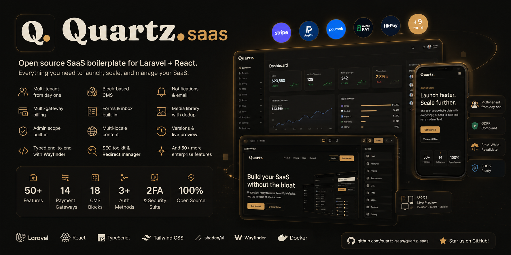

<!--
    Quartz — Multi-tenant SaaS boilerplate for Laravel + Inertia + React.
    Repo: github.com/obaidaattaee/quartz-saas
-->

<p align="center">
  
</p>

<h1 align="center">Quartz</h1>

<p align="center">
  <strong>The multi-tenant SaaS boilerplate that already speaks payments your region understands.</strong>
  <br/>
  Laravel 13 · Inertia 3 · React 19 · TypeScript · Tailwind 4 · Postgres 16
</p>

<p align="center">
  <a href="https://github.com/obaidaattaee/quartz-saas/actions"></a>
  
  
  
  
  
</p>

<p align="center">
  <a href="#-quick-start">Quick start</a> ·
  <a href="#-features">Features</a> ·
  <a href="#-tech-stack">Tech stack</a> ·
  <a href="#-architecture">Architecture</a> ·
  <a href="#-roadmap">Roadmap</a> ·
  <a href="#-contributing">Contributing</a>
</p>

---

## Why Quartz?

Most Laravel starter kits stop at auth + a dashboard. Real SaaS products need a lot more — and Quartz ships the lot.

- **Multi-tenancy** is in the core, not bolted on after launch.
- **13 payment gateways** across Global, MENA, GCC, and SE-Asia — including the ones Stripe and Paddle don't cover.
- **Admin scope** with impersonation, audit log, webhook replay, RBAC, and GDPR purge — so support and ops aren't an afterthought.
- **White-label by default** — drop a logo + name in CMS Globals and your fork looks like *your* product, not a clone of the boilerplate.
- **~580 feature tests** so you can refactor without holding your breath.

Fork it, rename it, ship it.

## ✨ Features

### Auth & identity
- Email + password, email verification, password reset, 2FA (TOTP) + recovery codes
- Magic-link login (passwordless, 15-min signed URL)
- Social login via Socialite (Google + GitHub out of the box, designed for easy add)
- Session management (revoke individual or all), login history, force-password-reset gate
- Account deletion (soft + 30-day purge)

### Multi-tenancy
- Path-based today (`/t/{slug}/...`); pluggable `TenantResolver` interface ready for subdomain + custom-domain
- `tenants` + `tenant_memberships` with Owner / Admin / Member roles (Spatie permissions, team-scoped per tenant)
- Tenant invitations (signed-token email links, public landing for non-users)
- Tenant switcher, owner transfer, soft-delete with 30-day recovery
- Per-tenant white-label: custom logo, brand color, preferred payment gateway

### Billing — 13 gateways, one interface
| Region | Gateways |
|---|---|
| **Global** | Stripe · PayPal |
| **Egypt** | Paymob · Fawry · PayTabs · Geidea |
| **GCC** | Amazon Payment Services (Payfort) · Telr · HyperPay · MyFatoorah |
| **Malaysia + SE-Asia** | HitPay · Billplz · iPay88 |

- Polymorphic `PaymentGateway` + `SubscriptionGateway` interfaces — every driver implements the same contract
- `GatewayRegistry` resolves drivers at boot; no `app(StripeGateway::class)` couplings
- Per-tenant preferred gateway, pre-selected on the checkout picker
- Plans + subscriptions + invoices + payments + gateway_customers + webhook_events
- Dunning (failed-payment retry queue), trial reminders, checkout abandonment reminders
- Inbound webhook router with signature verification + admin replay UI

### Admin scope (`/admin`)
- Tenants index + detail (subscription, invoices, payments, audit, login history, outbound webhook deliveries with **retry**)
- Users admin: suspend, restore, force-password-reset, disable 2FA, revoke sessions/tokens, grant/revoke Super Admin, impersonation, GDPR export
- Subscriptions + plans + checkout sessions + payment gateways + feature flags
- Audit log + webhook event replay
- Runtime app settings (override env vars without a restart)

### Notifications & email
- 12 events: welcome, email_verification, password_reset, magic_link, 2fa_recovery, tenant_invite, payment_receipt, plan_changed, trial_ending, payment_failed, login_alert, checkout_abandonment_reminder
- Per-user **preferences matrix** (event × channel)
- Email + in-app channels enabled; Slack/SMS reserved
- **Modern email shell** — branded gradient header, rounded card, accent CTA, dark-mode media queries — applies to every Mailable

### CMS (`/admin/cms`)
- Pages (drag-drop block editor with `cms_page_versions` history)
- Blog (posts, categories, tags)
- Globals (brand, header/footer nav, announcement bar, SEO defaults, cookie banner, social, analytics)
- Reusable collections (features, testimonials, FAQs, logos)
- Forms + submissions + CSV export, newsletter integration
- Media library, redirects with 404-log conversion
- Public marketing surface: landing, pricing, docs, blog, legal, contact, sitemap, robots, OG images

### API & integrations
- Sanctum (SPA + personal access tokens with abilities)
- `/api/v1/*` with Scribe-generated docs
- Outbound webhooks (HMAC-signed, retry with exponential backoff)
- Per-token rate limiting

### Security & compliance
- GDPR data export (tenant + user)
- Encrypted PII at rest (Laravel `encrypted` casts) — `phone` ships encrypted, pattern documented for more fields
- 30-day soft-delete → hard-purge job for tenants
- Audit log via model observers (create/update/delete diffs)
- Login alerts on new device, 2FA recovery-code consumption alert
- Rate limiting on auth endpoints
- HTTPS-only cookies, SameSite=Lax, CSRF on all POST routes

### Developer experience
- **Docker dev stack** — PHP-FPM + nginx + Postgres + Redis in one `docker compose up`
- **Wayfinder typed routes** — no string URLs in TypeScript
- Shared `<DataTable<T>>` + `<LocalDataTable<T>>` with server-driven filter/sort/pagination/CSV export
- Light / dark mode (cookie-based)
- Command palette (cmd+k)
- Toast notifications (sonner)
- Onboarding wizard for new tenants
- ~580 feature tests covering every controller + service action

## 🚀 Quick start

```bash
# Clone + boot the stack (Postgres 16 + Redis 7 + PHP-FPM + nginx)
git clone https://github.com/obaidaattaee/quartz-saas.git my-saas
cd my-saas
cp .env.example .env
docker compose up -d

# Install deps inside the container
docker compose exec app composer install
docker compose exec app pnpm install
docker compose exec app php artisan key:generate
docker compose exec app php artisan migrate --seed

# Start Vite dev server (HMR on :5173)
docker compose exec -d app pnpm dev

# Visit:
#   http://localhost:8080            — marketing site
#   http://localhost:8080/login      — log in (seeded super admin)
#   http://localhost:8080/admin      — super admin scope
```

Default super admin credentials (seeded via `DatabaseSeeder`):

| Email | Password |
|---|---|
| `super@example.test` | `password` |

> [!IMPORTANT]
> **Do not run `composer`, `php`, `artisan`, `pnpm`, or `psql` on the host.** The dev stack uses container-local vendor + node_modules. Always prefix with `docker compose exec app ...`. See [`CLAUDE.md`](./CLAUDE.md) for the full conventions.

## 🧱 Tech stack

**Backend**
- [Laravel 13](https://laravel.com) · PHP 8.4
- [Laravel Fortify](https://github.com/laravel/fortify) (auth) · [Laravel Sanctum](https://laravel.com/docs/sanctum) (API tokens)
- [Spatie Laravel Permission](https://spatie.be/docs/laravel-permission) (team-scoped roles)
- Postgres 16 · Redis 7 (cache, session, queue)
- Scribe (API docs) · Sentry (errors) · league/flysystem-aws-s3 (object storage)

**Frontend**
- [Inertia.js 3](https://inertiajs.com) (server-routed React)
- [React 19](https://react.dev) · TypeScript 5
- [Tailwind CSS 4](https://tailwindcss.com)
- [shadcn/ui](https://ui.shadcn.com) (new-york preset) + [Radix UI](https://www.radix-ui.com) primitives
- [Wayfinder](https://github.com/laravel/wayfinder) (typed routes)
- [Vite](https://vitejs.dev) (HMR + production bundling)

**Infra**
- Docker Compose (dev + prod stacks)
- Multi-stage Dockerfile (php-fpm + nginx + supervisord)
- pg_dump → S3 backup script (daily cron)
- Optional: Fly.io · Railway · DigitalOcean App Platform

## 🗂️ Architecture

```
app/
├── Http/
│   ├── Controllers/
│   │   ├── Admin/            # /admin/* — Super Admin scope
│   │   ├── API/V1/           # /api/v1/* — Sanctum-protected JSON
│   │   ├── Auth/             # Magic-link, social, 2FA
│   │   ├── Billing/          # Plans, invoices, gateway webhooks
│   │   ├── Checkout/         # Polymorphic checkout funnel
│   │   ├── Marketing/        # Public landing, docs, blog, forms
│   │   ├── Settings/         # /settings/* — Per-user
│   │   └── Tenants/          # /t/{slug}/* — Tenant scope
│   └── Middleware/           # SetCurrentTenant, EnforcePasswordReset, …
│
├── Models/                   # 50+ Eloquent models with #[Fillable]
├── Notifications/            # Notification classes
├── Mail/                     # 13 branded Mailables (modern shell)
├── Jobs/                     # Queued work (deliveries, purges, reminders)
├── Listeners/                # Event subscribers
├── Observers/                # Audit log + side effects
└── Support/                  # Service-layer single seam
    ├── Admin/                # TenantAdminService, UserAdminService, ImpersonationService
    ├── Auth/                 # MagicLinkService, LoginHistoryRecorder
    ├── Billing/              # GatewayRegistry + 13 gateway drivers
    ├── Cms/                  # GlobalsService, block renderer
    ├── Notifications/        # NotificationDispatcher (single seam)
    └── Tenancy/              # TenantResolver, TenantService

resources/js/
├── app.tsx                   # Layout dispatch by page-name prefix
├── components/
│   ├── admin/entity-detail/  # EntityHeader, FactCard, ActivityPanel, …
│   ├── data-table/           # <DataTable<T>> + <LocalDataTable<T>>
│   └── ui/                   # shadcn primitives
├── layouts/                  # AppLayout, AdminLayout, AuthLayout, PublicLayout
├── pages/                    # Inertia pages, mirror controller folders
└── routes/                   # Wayfinder-generated typed routes
```

**Design principles**
- **Service-layer single seam** — every cross-cutting mutation goes through ONE canonical service (`TenantAdminService::suspend`, `BillingService::recordPayment`, `NotificationDispatcher::send`). Direct writes outside the service are bugs.
- **Driver registries** — payment gateways and (future) social providers are pluggable via `Registry` classes; resolve through the registry, never `app(SpecificDriver::class)`.
- **Migrations are append-only** — once any environment has run a migration, schema changes need a new timestamped one.
- **Money as integer cents** — `*_cents` columns + a paired `currency`. No floats for currency.

## 📸 Screenshots

> Coming soon. In the meantime — see `agent-os/product/` for product specs that drove the UI.

## 🗺️ Roadmap

Quartz is at **v1** as of the latest release. The full multi-phase product plan lives in [`agent-os/product/roadmap.md`](./agent-os/product/roadmap.md). Recent + upcoming highlights:

**Shipped**
- ✅ Auth & identity (Phase 1)
- ✅ Multi-tenancy (Phase 2)
- ✅ Billing core + 13 gateway drivers (Phase 3.0–3.4)
- ✅ Admin scope (Phase 4)
- ✅ Sanctum API + outbound webhooks (Phase 5)
- ✅ Notifications + modern email shell (Phase 6)
- ✅ Marketing site + CMS + docs (Phase 7)
- ✅ Compliance: GDPR purge, encrypted PII, audit log, login alerts (Phase 8)
- ✅ DX polish: command palette, onboarding, light/dark (Phase 9)
- ✅ Daily DB backup, Sentry, deploy paths for 4 targets (Phase 10)

**In progress**
- 🟡 Phase 3.5 — multi-gateway UX leftovers (multi-currency switcher, tax/VAT engine)
- 🟡 Slack + SMS notification drivers (channels reserved)
- 🟡 i18n pass + RTL verification for Arabic

**Planned**
- Subdomain tenancy + custom-domain resolver
- Mobile SDK starters (RN + Flutter)
- SSO (SAML / OIDC), SCIM, fine-grained RBAC

## 🤝 Contributing

PRs welcome! Quartz is built to be forked per project — so the bar is "useful in 80% of SaaS use cases", not "infinite configurability". Before you open a PR:

1. Run the test suite: `docker compose exec app php artisan test` (must stay green)
2. Run Pint + types: `docker compose exec app vendor/bin/pint && docker compose exec app pnpm types:check && docker compose exec app pnpm lint`
3. Add a feature test for any controller/service action you add
4. Follow the conventions in [`CLAUDE.md`](./CLAUDE.md) and [`agent-os/standards/`](./agent-os/standards/)

Found a bug? [Open an issue](https://github.com/obaidaattaee/quartz-saas/issues) with reproduction steps.

## 📦 Deployment

Quartz ships first-party deploy paths for four targets, listed easiest to most flexible:

| Target | Best for | TLS | Managed DB |
|---|---|---|---|
| **Fly.io** | Solo founders, edge deploys | Auto | Fly Postgres |
| **Railway** | Heroku-style dashboards | Auto | Railway plugins |
| **DigitalOcean App Platform** | Predictable monthly bill | Auto | DO managed DB |
| **Self-hosted Docker** | Full control, on-prem, EU sovereignty | nginx-proxy + acme | Containers |

See [`docs/deployment.md`](./docs/deployment.md) for env-var checklists, OAuth callback URLs, and the production `docker-compose.prod.yml`.

## 📄 License

Quartz is open-source software licensed under the **MIT license**. Fork freely, ship commercially, no attribution required (but a star is appreciated 🌟).

## 🙏 Acknowledgements

Quartz stands on the shoulders of:
- [Laravel](https://laravel.com) · [Inertia.js](https://inertiajs.com) · [React](https://react.dev) · [Tailwind CSS](https://tailwindcss.com)
- [shadcn/ui](https://ui.shadcn.com) · [Radix UI](https://www.radix-ui.com) · [lucide-react](https://lucide.dev)
- [Spatie Laravel Permission](https://spatie.be/docs/laravel-permission) · [Laravel Fortify](https://github.com/laravel/fortify) · [Sanctum](https://laravel.com/docs/sanctum)
- Every payment-gateway team that shipped clear SDKs and webhook docs

Built with care by [@obaidaattaee](https://github.com/obaidaattaee).

---

<p align="center">
  <sub>If Quartz saved you a week of boilerplate work, <a href="https://github.com/obaidaattaee/quartz-saas">star the repo</a> — it's the only currency open-source maintainers really get paid in.</sub>
</p>
